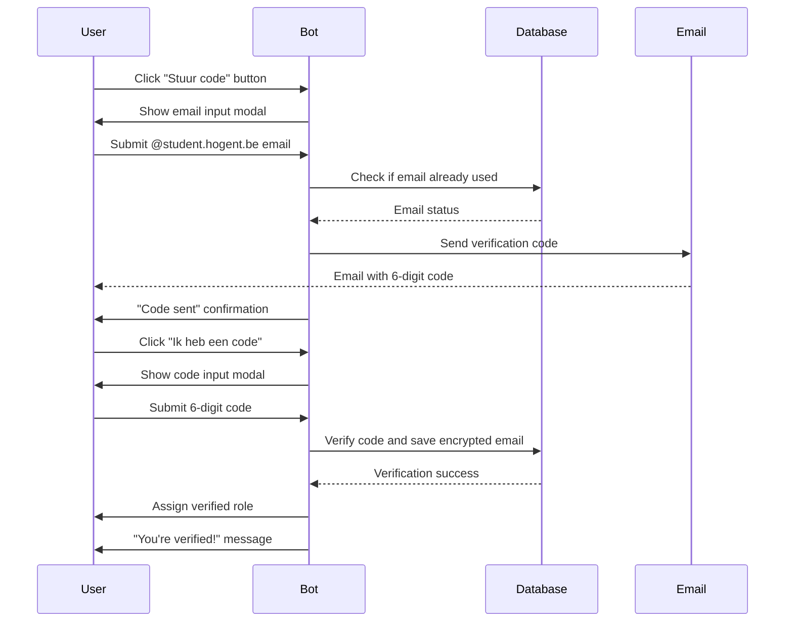
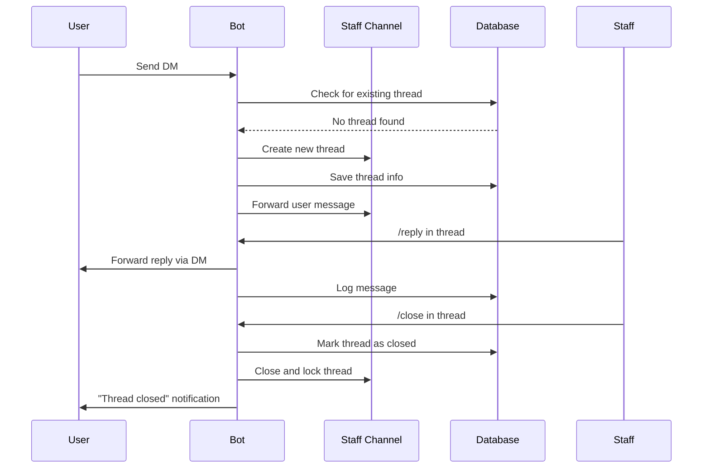
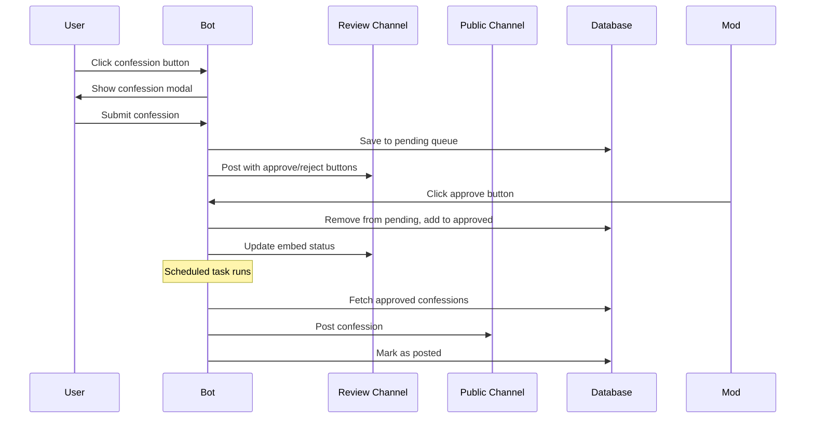

# Architecture Documentation

This document describes the structure, components, and design of the TI Discord Bot.

## Project Structure

```
ti-bot/
├── main.py                      # Bot entry point and core setup
├── env.py                       # Environment variable loader
├── generate_key.py              # Encryption key generator
├── migrate.py                   # Database migration script
├── test_email_config.py         # Email configuration tester
├── requirements.txt             # Python dependencies
├── pyproject.toml              # Tool configuration (Black, Ruff)
├── .pre-commit-config.yaml     # Pre-commit hooks configuration
├── docker-compose.yml          # Docker orchestration
├── Dockerfile                  # Container image definition
├── example.env                 # Environment template
│
├── cogs/                       # Feature modules (cogs)
│   ├── channel_menu.py         # Year/track channel selection
│   ├── configure.py            # Main configuration interface
│   ├── developing.py           # Developer commands (sync, restart, shutdown)
│   ├── developer_management.py # Developer ID management
│   ├── examresults.py          # Exam results announcements
│   ├── help.py                 # Custom help command
│   ├── job_info.py             # Job experience sharing
│   ├── modmail.py              # Modmail ticket system
│   ├── owner_disabled.py       # Owner commands (disabled in production)
│   ├── ping.py                 # Latency checker
│   ├── report.py               # User/message reporting
│   ├── role_selector.py        # Role selection interface
│   ├── settings_old.py         # Legacy setup commands
│   ├── unban_request.py        # Unban request system
│   ├── verification.py         # Email verification system
│   │
│   ├── confessions/            # Anonymous confession system
│   │   ├── __init__.py
│   │   ├── confession_commands.py  # Force review/post commands
│   │   ├── confession_modal.py     # Submission modal
│   │   ├── confession_tasks.py     # Scheduled tasks
│   │   ├── confession_view.py      # Approval UI
│   │   └── rules_modal.py          # Rules editor modal
│   │
│   └── moderation/             # Moderation suite
│       ├── __init__.py
│       ├── ban_system.py           # Ban functionality
│       ├── mute_system.py          # Mute functionality
│       ├── timeout_system.py       # Timeout functionality
│       ├── moderation_commands.py  # All mod commands
│       ├── moderation_tasks.py     # Scheduled tasks
│       ├── moderation_utils.py     # Helper functions
│       └── moderation_views.py     # UI components
│
└── utils/                      # Shared utilities
    ├── checks.py               # Custom permission checks
    ├── crypto.py               # Encryption utilities
    ├── email_sender.py         # Email sending functions
    ├── errors.py               # Custom exception classes
    ├── has_admin.py            # Admin permission check
    ├── has_role.py             # Role permission check
    ├── models.py               # Data models
    ├── persistent_views.py     # Persistent UI views
    ├── thread.py               # Thread management
    ├── time.py                 # Time utilities
    ├── timezone.py             # Timezone handling
    ├── utils.py                # General utilities
    └── verification_check.py   # Verification helpers
```

## Core Components

### Main Bot (`main.py`)

The main bot class extends `commands.Bot` and handles:

- **MongoDB Connection**: Async connection via Motor driver
- **Event Loop Management**: Custom event loop setup for aiohttp compatibility
- **Discord Intents**: Configured for guilds, members, messages, reactions, etc.
- **Logging System**:
  - File logging with rotation (`bot.log`)
  - Console logging with POD_UID prefix
  - Discord webhook logging for remote monitoring
  - Configurable log format (embed or plaintext)
- **Graceful Shutdown**: Signal handlers for SIGTERM/SIGINT
- **Persistent Views**: Auto-loaded UI components that survive restarts
- **Cog Loading**: Automatic discovery and loading of feature modules
- **Developer Management**: Database-driven developer ID system
- **Thread Manager**: Modmail thread tracking and management

**Key Features**:

- Custom activity: "DM mij om de staff te contacteren"
- Default command prefix: `?` (for legacy commands)
- Color theme: Discord Blurple
- Auto-sync commands on startup
- Error handling for application commands

### Database Schema

MongoDB collections used by the bot:

| Collection      | Purpose             | Key Fields                                              |
| --------------- | ------------------- | ------------------------------------------------------- |
| `settings`      | Bot configuration   | `_id`, various feature-specific settings                |
| `verifications` | Email verifications | `user_id`, `email_encrypted`, `email_index`, `migrated` |
| `threads`       | Modmail threads     | `user_id`, `channel_id`, `open`, `messages`             |
| `warnings`      | User warnings       | `user_id`, `moderator_id`, `reason`, `timestamp`        |
| `cases`         | Moderation cases    | `case_id`, `user_id`, `type`, `reason`, `moderator_id`  |

Settings document structure (`_id: "server_settings"`):

- `developer_ids`: List of user IDs with developer access
- `webhook_log_format`: "embed" or "plaintext"
- Various channel/role IDs for features

### Environment Configuration (`env.py`)

Loads and validates environment variables from `.env`:

**Discord & Database**:

- `BOT_TOKEN`: Discord bot authentication
- `MONGODB_*`: Connection details (IP, port, username, password, database)
- `WEBHOOK_URL`: Discord webhook for logging

**Email Verification**:

- `SMTP_*`: Outgoing mail settings
- `IMAP_*`: Incoming mail settings (for bounce checking)
- `MIGRATION_*`: Separate Gmail settings for migration bounce checks

**Security**:

- `ENCRYPTION_KEY`: Fernet key for encrypting emails
- `EMAIL_INDEX_KEY`: Key for hashing emails for duplicate detection

**Optional**:

- `DISCORD_GUILD_ID`: Override default guild ID
- `POD_UID`: Kubernetes pod identifier for logging
- `OLD_CONNECTION_STRING`: Legacy database for migration

## Cog System

The bot uses discord.py's cog system to organize features into modules. Each cog is a Python class that extends `commands.Cog`.

### Core Cogs

#### Configure (`configure.py`)

**Purpose**: Central configuration interface  
**Commands**: `/configure`  
**Features**:

- Category-based configuration menu
- Server settings (roles, channels)
- Modmail configuration
- Confession system setup
- Verification settings
- Reports configuration
- Job info configuration
- Developer management interface

#### Verification (`verification.py`)

**Purpose**: HOGENT student email verification  
**Commands**: `/get_email`, `/unverify`, `/migrate_email_index`, `/cleanup_unverified`, `/manual_verify`  
**Features**:

- Persistent verification button view
- Email modal for code sending
- Code submission modal
- Encrypted email storage with Fernet
- Email indexing for duplicate detection
- Graduation migration support
- Bounce checking via IMAP
- Automatic role assignment

#### Modmail (`modmail.py`)

**Purpose**: Private ticket system for member-staff communication  
**Commands**: `/close`, `/modmail_history`, `/modmail_user_history`, `/nsfw`, `/sfw`, `/reply`, `/areply`, `/note`, `/edit`, `/contact`, `/delete`  
**Features**:

- Thread creation on DM
- Message forwarding between DM and staff channel
- Anonymous replies
- Thread logging
- NSFW/SFW toggling
- Note system for internal comments
- Message editing and deletion
- User history lookup

#### Moderation (`moderation/`)

**Purpose**: Complete moderation toolkit  
**Commands**: `/kick`, `/ban`, `/unban`, `/warn`, `/warnings`, `/timeout`, `/untimeout`, `/mute`, `/unmute`, `/clear_warnings`, `/purge`, `/ban_check`, `/case_info`  
**Features**:

- Multiple punishment types (kick, ban, mute, timeout, warn)
- Warning system with persistent storage
- Case management with unique IDs
- Automatic logging to designated channel
- Ban lookup by user ID or username
- Bulk message deletion (purge)
- Duration parsing for temporary punishments

### Communication Cogs

#### Confessions (`confessions/`)

**Purpose**: Anonymous confession posting with moderation  
**Commands**: `/force_review`, `/force_post`, `/confession_stats`  
**Features**:

- Modal-based submission
- Queue system for pending confessions
- Approval/rejection workflow
- Configurable rules display
- Scheduled posting task
- Statistics tracking

#### Reports (`report.py`)

**Purpose**: User and message reporting to moderators  
**Commands**: `/report`, `/handle_report`  
**Features**:

- User reporting with reason
- Optional message ID for context
- Moderator role pinging
- Report handling workflow
- Embed-based report display

#### Job Info (`job_info.py`)

**Purpose**: Platform for sharing job experiences  
**Commands**: Context menu button  
**Features**:

- Modal-based submission
- Anonymous posting
- Designated channel configuration
- Timestamp tracking

### Utility Cogs

#### Help (`help.py`)

**Purpose**: Custom help command  
**Commands**: `/help`  
**Features**:

- Dynamic command list generation
- Permission-aware display
- Embed-based interface

#### Ping (`ping.py`)

**Purpose**: Bot latency checker  
**Commands**: `/ping`  
**Features**: Returns bot websocket latency in milliseconds

#### Exam Results (`examresults.py`)

**Purpose**: Announce exam result publication dates  
**Commands**: `/when_exam_results`  
**Features**: Database-stored date retrieval

#### Developer Management (`developer_management.py`)

**Purpose**: Manage developer access  
**Commands**: Called via `/configure`  
**Features**:

- Add/remove developers by ID
- List current developers
- Database persistence

#### Developing (`developing.py`)

**Purpose**: Bot control commands  
**Commands**: `!sync`, `!restart`, `!shutdown` (prefix commands)  
**Permissions**: Developer-only  
**Features**:

- Command tree synchronization
- Bot restart (requires process manager)
- Graceful shutdown

### Server Management Cogs

#### Channel Menu (`channel_menu.py`)

**Purpose**: Year and track-based channel access  
**Commands**: Persistent button view  
**Features**:

- Year selection buttons
- Track selection dropdown
- Channel access management
- Role assignment

#### Role Selector (`role_selector.py`)

**Purpose**: Self-service role assignment  
**Commands**: Persistent button/dropdown view  
**Features**:

- Configurable role options
- Multi-select support
- Persistent UI

#### Unban Request (`unban_request.py`)

**Purpose**: Process unban appeals  
**Commands**: Modal-based submission  
**Features**:

- DM-based submission
- Staff review interface
- Accept/deny workflow

### Disabled/Legacy Cogs

#### Owner Disabled (`owner_disabled.py`)

**Status**: Disabled in production  
**Commands**: `!py`, `!cogs`, `!load`, `!unload`, `!reload`  
**Purpose**: Code execution and cog management (development only)

#### Settings Old (`settings_old.py`)

**Status**: Legacy, replaced by `/configure`  
**Commands**: `/setup`  
**Purpose**: Old configuration interface

## Command and Event Flow

### Command Execution Flow

```mermaid
graph TD
    A[User invokes command] --> B{Command type?}
    B -->|Slash command| C[app_commands.command]
    B -->|Prefix command| D[commands.command]

    C --> E{Permission checks}
    D --> E

    E -->|Has permission| F[Check custom decorators]
    E -->|No permission| G[Send error message]

    F -->|@developer| H{User in developer_ids?}
    F -->|@has_role| I{User has role?}
    F -->|Other checks| J{Check passes?}

    H -->|Yes| K[Execute command]
    H -->|No| G
    I -->|Yes| K
    I -->|No| G
    J -->|Yes| K
    J -->|No| G

    K --> L{Command succeeds?}
    L -->|Yes| M[Send response]
    L -->|No| N[Error handler]

    N --> O[Log error]
    O --> P[Send error message]
```

### Event Flow Examples

#### Verification Flow



#### Modmail Thread Flow



#### Confession Flow



## Custom Error Handling

The bot implements custom error classes in `utils/errors.py`:

- `ForbiddenAction`: Permission denied
- `ResponseTimeout`: User didn't respond in time
- `UnknownEmoji`: Emoji not found
- `UnknownInvite`: Invalid invite link
- `UnknownMessage`: Message not found
- `UnknownRole`: Role not found
- `UnknownUser`: User not found

Global error handler in `main.py` catches all app command errors and provides user-friendly responses.

## Logging Architecture

### Multi-tier Logging System

1. **File Logging** (`bot.log`):

   - Rotating file handler (1MB max, 1 backup)
   - Includes all log levels
   - Formatted with POD_UID prefix if set

2. **Console Logging**:

   - Real-time output to stdout
   - Same format as file logs
   - Useful for Docker container logs

3. **Discord Webhook Logging**:
   - Asynchronous queue-based processing
   - Rate limiting (max 1 message per 2 seconds)
   - Retry logic for failed sends (up to 3 attempts)
   - Configurable format (embed or plaintext)
   - Fallback file logging (`webhook_status.log`)

### Log Levels

- `DEBUG`: Detailed diagnostic information
- `INFO`: General informational messages (default)
- `WARNING`: Warning messages
- `ERROR`: Error messages
- `CRITICAL`: Critical failures

## Security Features

### Data Encryption

- Email addresses encrypted with Fernet (symmetric encryption)
- Encryption key stored in environment variables
- Email indices use HMAC-SHA256 for duplicate detection without storing plaintext

### Permission System

- Role-based access control via Discord permissions
- Custom `@developer()` decorator for bot developers
- Database-stored developer IDs (not hardcoded)
- Permission checks before command execution

### Environment Security

- All sensitive data in `.env` file (not in code)
- `.env` excluded from version control
- URL encoding for MongoDB passwords

### Input Validation

- Email regex validation for verification (`@student.hogent.be`)
- Bounce checking for graduated student migration
- User ID validation in developer management

## Performance Considerations

### Async Operations

- All I/O operations are asynchronous (aiohttp, motor)
- Non-blocking database queries
- Async email sending

### Caching

- Guild ID cached after first fetch
- Persistent views loaded once at startup
- Discord member cache (10,000 messages)

### Database Optimization

- Indexed fields for quick lookups (user_id, email_index)
- Aggregation pipelines for complex queries
- Connection pooling via Motor

## Extension Points

The bot is designed to be easily extended:

### Adding a New Cog

1. Create `cogs/your_feature.py`
2. Define a class extending `commands.Cog`
3. Add commands with `@app_commands.command()`
4. Include `async def setup(bot)` function
5. Bot automatically loads on startup

### Adding a New Command

1. Define method with `@app_commands.command()` decorator
2. Add permission checks with `@is_council()/@is_moderator()/@is_admin()`
3. Use `@app_commands.describe()` for parameter descriptions
4. Run `!sync` to register with Discord

### Adding Persistent Views

1. Define view class with `timeout=None`
2. Add `custom_id` to buttons/selects
3. Register in `utils/persistent_views.py`
4. Views persist across bot restarts

## Next Steps

- [4-COMMANDS_REFERENCE.md](4-COMMANDS_REFERENCE.md) - Detailed command documentation
- [5-CONTRIBUTING.md](5-CONTRIBUTING.md) - Development guidelines
- [7-LIMITATIONS.md](7-LIMITATIONS.md) - Known limitations and constraints
